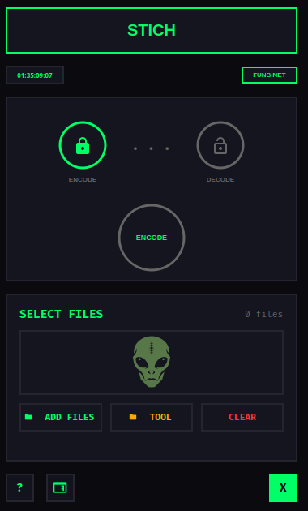
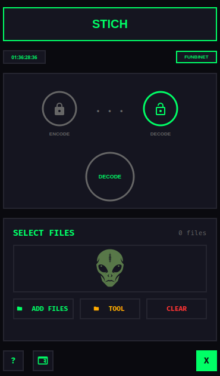
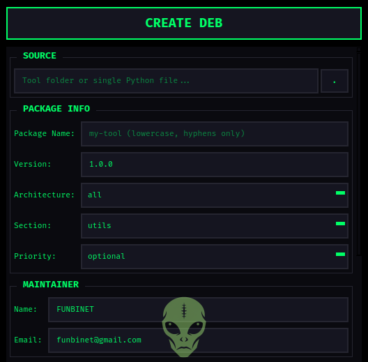
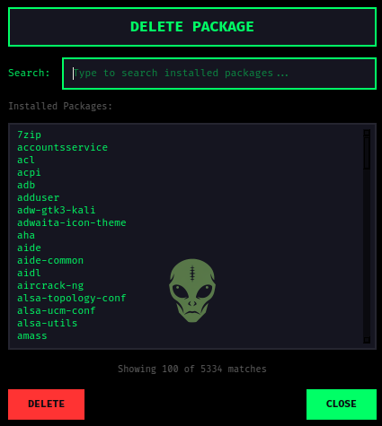

<p align="center">
  
</p>

<h1 align="center">STICH</h1>

<p align="center">
  <b>Secure Text Interleaving & Code Hashing</b>
</p>

<p align="center">
  <strong>Codeberg:</strong> <a href="https://codeberg.org/funbinet">codeberg.org/funbinet</a> •
  <strong>GitHub:</strong> <a href="https://github.com/funbinet">github.com/funbinet</a> •
  <strong>License:</strong> Proprietary
</p>

<p align="center">
  <a href="mailto:funbinet@gmail.com">
    
  </a>
</p>

---

## Overview

**STICH** (Secure Text Interleaving & Code Hashing) is a modern, feature-rich GUI
application for Python code obfuscation and Debian package creation on Linux. Built
with Python and PyQt6, it provides a unified interface for protecting source code
and distributing applications through a streamlined graphical interface.

The application transforms complex obfuscation workflows into a simple one-click
experience, eliminating the need to manually encode files, configure package metadata,
and build installers. STICH orchestrates the entire protection lifecycle from
source encoding to distributable package creation.

---

## Core Purpose

STICH addresses the fundamental challenges in protecting Python source code:

- **Code Exposure**: Python source files are easily readable by anyone
- **Standard Decoders**: Base64 and simple encryption are trivially reversed
- **Distribution Complexity**: Creating proper Debian packages requires extensive knowledge
- **Package Management**: Installing and removing custom packages is cumbersome
- **Root GUI Apps**: Running elevated GUI applications breaks display access

STICH solves these problems by providing a single, integrated platform that
handles the entire protection and distribution workflow automatically.

---

## Architecture & Design

<p align="center">
  
</p>

### Unified Interface
- **Single Application**: One GUI for encoding, decoding, and packaging
- **Visual Feedback**: Real-time status indicators for each operation
- **Modern Theme**: Clean, professional green-themed design
- **Session Tracking**: Built-in clock with centisecond precision

### Multi-Layer Protection
- **zlib Compression**: Level 9 compression reduces size and adds complexity
- **XOR Encryption**: SHA-256 derived key from proprietary salt
- **Reversed Base64**: Custom alphabet defeats standard decoders
- **Magic Header**: STICH_V1 validation prevents tampering

### Intelligent Automation
- **One-Click Encoding**: Single button to protect entire projects
- **Auto-Configuration**: Automatic package metadata and launcher creation
- **Package Management**: Create, install, and delete packages from one interface
- **Smart Recovery**: Original files remain untouched during processing

---

## Encoding Pipeline

STICH uses a sophisticated multi-layer encoding process:

### Source to Protected File

**Pipeline**:
Source Code -> zlib Compress -> XOR Encrypt -> Reversed Base64 -> Wrapper

**Why Standard Decoders Fail**:
1. **Reversed Alphabet**: Z-A, z-a, 9-0 produces garbage with standard Base64
2. **XOR Layer**: Even correct Base64 decoding yields encrypted data
3. **Compression**: Raw decoded data is zlib compressed
4. **Magic Check**: Decoder validates STICH_V1 header first

### Encoding Constants

| Component | Value |
|-----------|-------|
| Magic Header | STICH_V1 |
| Salt | FunBiNet_Proprietary_2026 |
| Compression | zlib level 9 |
| Hash Algorithm | SHA-256 |
| Base64 Alphabet | Reversed (Z-A, z-a, 9-0, +/) |

---

## Operation Modes

STICH supports three primary operation modes:

### 1. Encode Mode
**Purpose**: Protect Python source code from inspection.

<p align="center">
  
</p>

**Process**:
- Select files -> Compress -> Encrypt -> Encode -> Save as -enc.py

**Benefits**:
- Source code becomes unreadable
- Standard decoders produce garbage
- Encoded files remain importable
- Original files untouched

**Activation**: Click ENCODE indicator

### 2. Decode Mode
**Purpose**: Restore original source from encoded files.

<p align="center">
  
</p>

**Process**:
- Select encoded files -> Decode -> Decrypt -> Decompress -> Save as -dec.py

**Benefits**:
- Recover original source code
- Verify encoding worked correctly
- Edit and re-encode as needed
- Batch processing supported

**Activation**: Click DECODE indicator

### 3. Tool Mode
**Purpose**: Process entire project folders at once.

**Process**:
- Select folder -> Recursively find .py files -> Encode/Decode all -> Save to new folder

**Benefits**:
- Encode complete projects
- Preserves directory structure
- Skips non-Python files
- Creates -enc/ or -dec/ folder

**Activation**: Click TOOL button (folder icon)

---

## DEB Package Builder

STICH includes a complete Debian package creation system:

### Package Creation Flow
Source -> Package Info -> Icon -> Options -> .deb File

### Package Structure

mypackage_1.0.0_amd64.deb
- DEBIAN/control (Package metadata)
- opt/mypackage/ (Application files)
- usr/bin/mypackage (Launcher script)
- usr/share/applications/mypackage.desktop
- usr/share/icons/hicolor/256x256/apps/mypackage.png

### Package Options

| Feature | Description |
|---------|-------------|
| **Package Name** | Lowercase alphanumeric with hyphens |
| **Version** | Semantic version (e.g., 1.0.0) |
| **Architecture** | amd64, i386, all, arm64, armhf |
| **Section** | utils, net, devel, admin, etc. |
| **Priority** | optional, required, important |
| **Maintainer** | Name and email for Debian standards |
| **Dependencies** | Comma-separated package list |
| **Icon** | PNG/SVG/XPM for .desktop entry (required) |
| **Run as Root** | Enable sudo elevation for GUI apps |
| **Exclude Patterns** | Skip files/folders from package |

### Root Elevation (sudo)

When "Run as root" is enabled, the launcher:
- Preserves DISPLAY, XAUTHORITY, WAYLAND_DISPLAY
- Uses xhost +SI:localuser:root for display access
- Runs with sudo -E to maintain environment
- Fixes Qt display issues for GUI root applications

---

## Package Management

STICH provides complete package lifecycle management:

### CREATE
- Build .deb package from source folder or Python file
- Automatic control file generation
- Launcher script creation
- Desktop entry with icon

<p align="center">
  
</p>
<p align="center">
  
</p>

### INSTALL
- Install created package using pkexec elevation
- Button shows INSTALLED (green) or FAILED (red) state
- Immediate system integration

### DELETE
- Search installed packages by name
- Live filtering of package list
- Remove packages using dpkg -r
- Dependencies remain untouched

<p align="center">
  
</p>

---

## Key Features

### Professional GUI
- **Modern Interface**: Clean, professional green-themed design
- **Status Indicators**: Visual feedback for all operations
- **Real-Time Clock**: Current time display with centisecond precision
- **File List**: Track selected files for processing

### Code Protection
- **Multi-Layer Encoding**: zlib + XOR + Reversed Base64
- **Variable Obfuscation**: Random import and variable names
- **Import Compatible**: Encoded files remain fully importable
- **Batch Processing**: Process multiple files simultaneously

### Package Building
- **Full Control File**: All Debian package metadata fields
- **Icon Support**: PNG/SVG/XPM for application menus
- **Auto Launcher**: Creates executable in /usr/bin
- **Desktop Entry**: Application appears in system menus

### User Experience
- **No Popups**: Status shown in interface labels
- **File Browser**: Integrated source and icon selection
- **Exclude Patterns**: Filter unwanted files from packages
- **Help Documentation**: Integrated help dialog

---

## Technical Specifications

### System Requirements
- **Operating System**: Linux (Debian/Ubuntu/Kali)
- **Python Version**: 3.8 or higher
- **Memory**: 256MB RAM minimum
- **Storage**: 20MB free space
- **GUI Framework**: PyQt6

### Dependencies
- **Core Framework**: PyQt6 for GUI
- **Package Tools**: dpkg-deb for DEB creation
- **Utilities**: Standard Python libraries

---

## Installation

### Quick Install (Debian/Ubuntu)
```bash
# Download the DEB package
wget https://github.com/funbinet/stich/releases/download/v1.0.0/stich_1.0.0_all.deb

# Install dependencies and package
sudo apt install python3-pyqt6
sudo dpkg -i stich_1.0.0_all.deb

# Run STICH
stich
```

### Alternative: Manual Download
1. Go to [STICH Releases](https://github.com/funbinet/stich/releases/tag/v1.0.0)
2. Download `stich_1.0.0_all.deb`
3. Install with: `sudo dpkg -i stich_1.0.0_all.deb`
4. Fix any missing dependencies: `sudo apt --fix-broken install`

---

## Usage

### Launching STICH
```bash
# From terminal
stich
```

### Encoding Individual Files

1. Launch STICH
2. Click **ENCODE** indicator to select encode mode (green indicator active)
3. Click **ADD FILES** to select one or more Python files
4. Click the **ENCODE** button
5. Encoded files saved as `filename-enc.py` in the same directory

### Decoding Files

1. Click **DECODE** indicator to switch mode
2. Select encoded files using **ADD FILES**
3. Click the **DECODE** button
4. Decoded files saved as `filename-dec.py`

### Encoding Entire Tools

1. Click the **TOOL** button (folder icon)
2. Select the root folder of your Python tool
3. Choose **ENCODE** or **DECODE** mode
4. Click the action button
5. Creates a new folder `toolname-enc/` with all Python files processed

### Interface Controls

| Button | Function |
|--------|----------|
| **ENCODE** | Mode indicator (click to select) |
| **DECODE** | Mode indicator (click to select) |
| **ADD FILES** | Multi-file selection |
| **TOOL** | Select tool folder |
| **CLEAR** | Remove all selected files |
| **Action Button** | Execute encode/decode |
| **? (Help)** | Documentation dialog |
| **✕ (Close)** | Exit application |

### File Naming

| Operation | Input | Output |
|-----------|-------|--------|
| Encode File | `script.py` | `script-enc.py` |
| Decode File | `script-enc.py` | `script-dec.py` |
| Encode Tool | `mytool/` | `mytool-enc/` |
| Decode Tool | `mytool-enc/` | `mytool-dec/` |
| Duplicate | `script-enc.py` exists | `script-enc(1).py` |

---

## Security & Privacy

### Code Protection
- **Multi-Layer**: Three encoding layers for maximum protection
- **Custom Alphabet**: Reversed Base64 defeats standard tools
- **Proprietary Salt**: XOR key derived from secret salt
- **Header Validation**: Magic bytes prevent tampering

### Privacy Considerations
- **Local Only**: All processing happens locally
- **No Telemetry**: STICH does not send data anywhere
- **No Logging**: No activity logs created
- **Original Preserved**: Source files remain untouched

### Limitations
- **Obfuscation**: Not military-grade encryption
- **Reversible**: Determined attackers can reverse-engineer
- **Python Knowledge**: Anyone with Python skills can decode
- **Not for Secrets**: Do not use for cryptographic keys

### Ethical Use
- **Your Code Only**: Only encode code you own or have permission to protect
- **Backup Originals**: Always keep unencoded source copies
- **Legal Compliance**: Ensure obfuscation is legal in your jurisdiction
- **Responsible Use**: Do not use for malicious purposes

---

## Troubleshooting

### "Not STICH Encoded"
- File lacks STICH_V1 magic header
- File was not encoded with STICH
- File may be corrupted

### "Invalid STICH Format"
- Encoded payload is corrupted
- File was modified after encoding
- Encoding version mismatch

### Import Errors in Encoded Files
- Original file had syntax errors
- Encoding process was interrupted
- Try decoding and checking original

### DEB Package Fails to Build
- Ensure dpkg-deb is installed
- Package name must be lowercase alphanumeric
- Check source folder exists

### Root GUI App Shows Display Error
- xhost may not be installed
- DISPLAY variable not set
- Try running from terminal with sudo -E

### Permission Denied on Tool Folders
- Run with appropriate permissions
- Check folder ownership
- Ensure read access to all files

---

## Author Information

**funbinet** is a cybersecurity specialist currently pursuing a Computer Science
degree at Chuka University. With expertise in code protection, security tool
development, and system automation, funbinet develops comprehensive security
solutions that advance the field of software protection and distribution.

### Background
- **Education**: Computer Science student at Chuka University
- **Specialization**: Code Protection, Security Tools, Automation
- **Experience**: Developing security and privacy tools
- **Philosophy**: "Protect what you create"

### Projects
- **STICH**: Secure code obfuscation and packaging tool
- **SCHUT**: Secure VPN + Tor connection manager
- **LEVIATHAN**: Complete penetration testing suite
- **OMNISEC**: Comprehensive defensive security platform

### Contact
- **Email**: funbinet@gmail.com
- **Codeberg**: https://codeberg.org/funbinet
- **GitHub**: https://github.com/funbinet

---

## License

### Proprietary Software License

Copyright (c) 2026 funbinet

All rights reserved.

This software is the property of funbinet and is protected by copyright laws
and international copyright treaties. No part of this software may be reproduced,
distributed, or transmitted in any form or by any means, including photocopying,
recording, or other electronic or mechanical methods, without the prior written
permission of funbinet, except in the case of brief quotations embodied in
critical reviews and certain other noncommercial uses permitted by copyright law.

### Restrictions:

1. **No Redistribution**: You may not redistribute this software, in whole or in part, to any third party.
2. **No Modification**: You may not modify, adapt, translate, reverse engineer, decompile, or disassemble this software.
3. **No Commercial Use**: You may not use this software for commercial purposes, including but not limited to selling, renting, licensing, or distributing the software for a fee.
4. **No Transfer**: You may not transfer, lease, or sublicense this software to any other party.

### Limited License:

A limited, non-exclusive, non-transferable license is granted to the original
licensee for personal, non-commercial use only. This license is subject to all
terms and conditions of this agreement.

### Disclaimer:

This software is provided "as is" without warranty of any kind, express or
implied. funbinet shall not be liable for any damages arising from the use of
this software.

### Termination:

This license will terminate automatically if you violate any of these terms and
conditions. Upon termination, you must immediately cease all use of the software
and destroy all copies in your possession or control.

### Source Code Access

The source code for STICH is proprietary and not publicly available. If you
are interested in accessing the source code for research, educational, or
legitimate security purposes, please contact the author directly at funbinet@gmail.com
to discuss licensing and access arrangements.

---

<p align="center">
  <b>STICH</b> — Secure Text Interleaving & Code Hashing
  <br>
  <small>© 2026 funbinet • Proprietary Software • All Rights Reserved</small>
</p>
